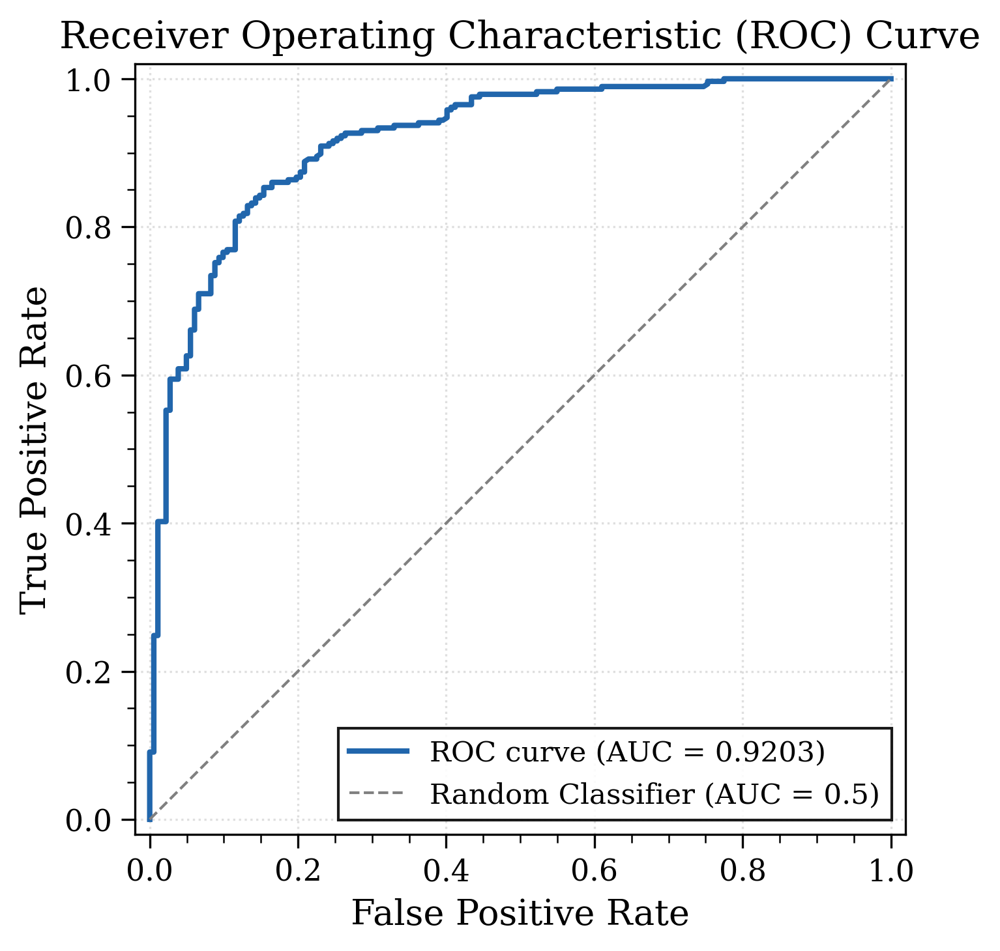

# eTripHLApan: Enhanced HLA-I Peptide Binding Prediction

Enhanced HLA-I peptide binding prediction using transfer learning and BLOSUM62 encoding, built on top of the original [TripHLApan](https://github.com/CSUBioGroup/TripHLApan).

**Paper:** *eTripHLApan: Improving HLA-I Peptide Binding Prediction through Transfer Learning and BLOSUM62 Encoding* — IWBBIO 2026 (link coming soon)

## Results

| Metric | Value |
|--------|-------|
| **AUC** | **0.9203** |
| Accuracy | 0.8483 |
| Precision | 0.8644 |
| Recall | 0.8916 |
| F1-Score | 0.8778 |
| Specificity | 0.7802 |

<p align="center">
  
</p>

## Repository Structure

```
├── eTripHLApan/
│   ├── train.py                       # Training (BLOSUM62 + transfer learning)
│   ├── test.py                        # Testing / evaluation
│   ├── data_preparation.py            # Convert CSV data to model format
│   ├── codes/                         # Core model implementation
│   │   ├── helper.py                  # Network architecture, encoding, dataset
│   │   ├── help_helper.py             # BLOSUM matrices, allele mapping
│   │   ├── data_pre_processing2.py    # Data loading
│   │   ├── blosum62.txt               # BLOSUM62 substitution matrix
│   │   ├── blosum50.txt               # BLOSUM50 substitution matrix
│   │   └── embedding_protein.txt      # Protein embeddings
│   ├── assistant_codes/               # HLA allele sequence mappings
│   └── for_prediction/                # Training, validation, and test data
├── models/eTripHLApan/                # Training logs, test metrics, ROC curves
├── plot_roc_auc.py                    # ROC-AUC curve plotting
└── create_network_flowchart.py        # Network architecture visualization
```

## Prerequisites

- Python 3.8+
- PyTorch
- scikit-learn
- pandas, numpy, matplotlib

```bash
pip install torch scikit-learn pandas numpy matplotlib
```

## Usage

### Train
```bash
cd eTripHLApan
python train.py
```

### Test
```bash
cd eTripHLApan
python test.py
```

### Prepare Your Own Data
```bash
cd eTripHLApan
python data_preparation.py
```

Input format: tab-separated peptide and HLA allele pairs:
```
AAGIGILTV	HLA-A*02:01
GILGFVFTL	HLA-A*02:01
```

## Model Weights

Trained model weights (`.pt` files) are excluded due to size. To reproduce, run `train.py`.

## Citation

If you use this work, please cite the IWBBIO 2026 paper (link and citation to be added upon publication).

## License

This project builds on the original TripHLApan. Please refer to the [original repository](https://github.com/CSUBioGroup/TripHLApan) for license terms.
